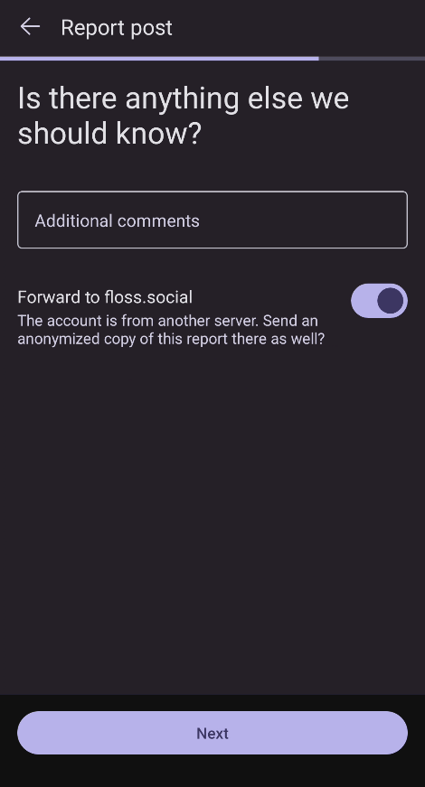

# CSAE Policy
## "Moshidon" CSAE Policy
> CSAE refers to child sexual abuse and exploitation, including content or behavior that sexually exploits, abuses, or endangers children. This includes, for example, grooming a child for sexual exploitation, sextorting a child, trafficking of a child for sex, or otherwise sexually exploiting a child. – Google Child Safety Standards Policy

## Posting or linking to CSAE

“Moshidon” allows you to create posts on your account’s server.

Using the application to post or link to CSAE is strictly prohibited.

## Reporting accounts posting or linking to CSAE
#### If you suspect a child is in immediate danger in any way, contact the police immediately.

If you see an account posting CSAE you can report it to your server’s moderators for further action.

Reporting an account is a four step process.

### 1. Start the report
Tap the “…” button at the bottom of any post from the account to show the per-post menu

Choose “Report” from the per-post menu.

### 2. Fill in appropriate server rule breakage information 

### 3. Optionally, include additional posts 
Choose one or more posts to report.

The post you chose at the previous step is automatically selected.

Tap the “Continue” button when you have finished selecting posts.

### 4. Finalise the report
Enter any additional information in the space provided.

Finalising the report

Tap the “Report” button.

The report will be sent to your server’s moderation team for action according to their published policies.

## Additional reporting
You may also want to report to the relevant organisations in your jurisdiction.

Google maintains a list of organisations to report CSAE organised by country.

If your country is not listed there it may be listed at INHOPE.

## Contact 
If you have any questions about this CSAE policy please contact moshidon.app@gmail.com.
