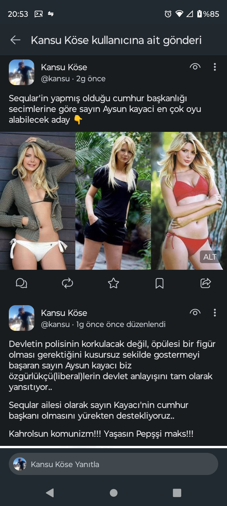
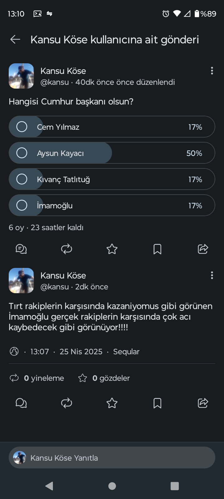
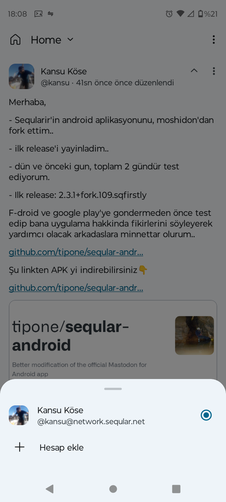
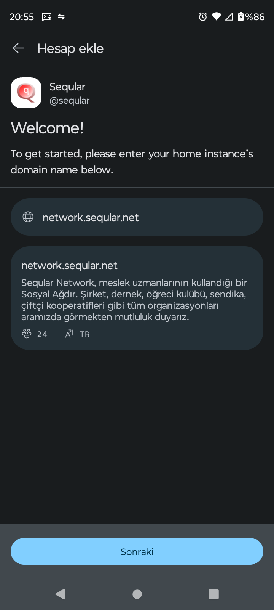
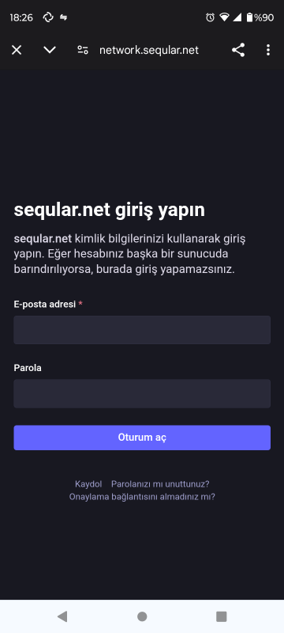
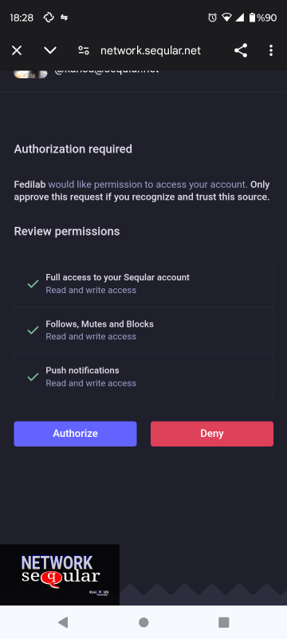
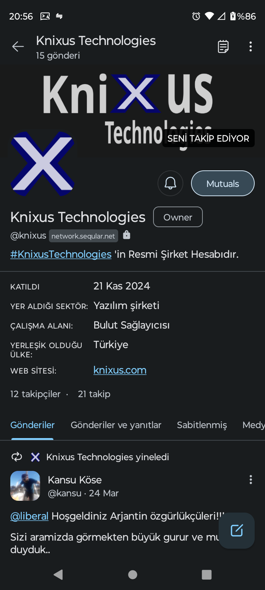
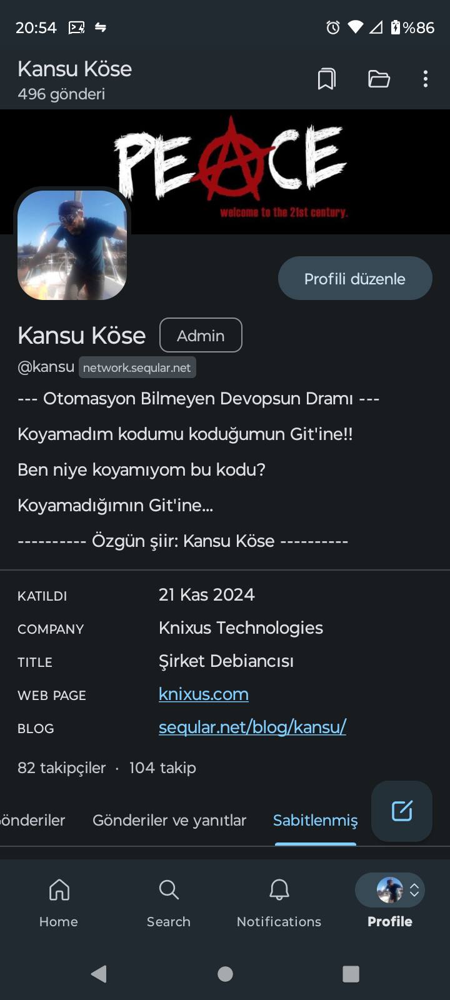
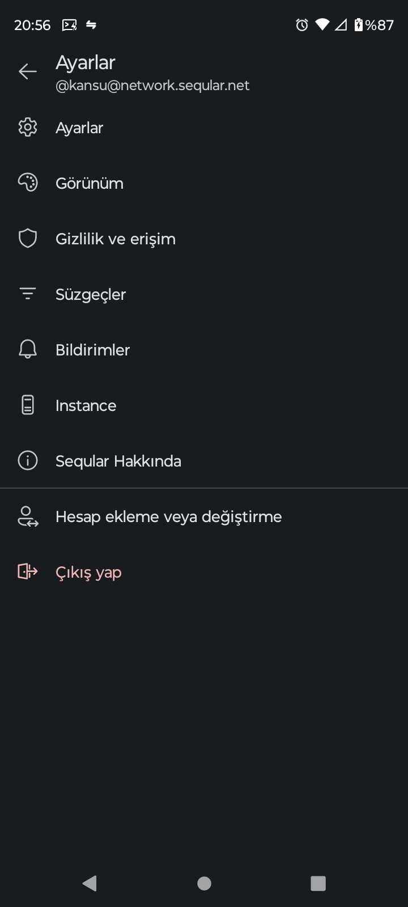

 
# A Social Network without Place or Nation.

### Seqular is a friendly fork from [moshidon](https://github.com/LucasGGamerM/moshidon) project.

> A fast, highly customizable, up-to-date fork of [moshidon](https://github.com/LucasGGamerM/moshidon) adding important features such as a fully federated timeline, unlisted posting, drafts, scheduled posts, bookmarks, and alt text warnings.

# Welcome to the Open Source Planet, Earthling!!
If you are tired of worthless content, bot accounts and algorithms that always treat you unfairly on conventional social media, you are in the right place.

# [Log in](https://network.seqular.net/auth/sign_in)

If you don't have an account yet, visit our [sign up](https://network.seqular.net/auth/sign_up) page.
## What is Seqular?

* [Seqular](https://seqular.net) is a community that is founded by a group of free and open source code developers in Türkiye.
* We are strictly committed to the [Free Software](https://www.gnu.org/) and open source philosophy and the policies of the [Fediverse](https://en.wikipedia.org/wiki/Fediverse).
* We believe it's important that Seqular never be a company, but instead remain a non-commercial community and we promise to always remain so.
* [Seqular Server Source](https://github.com/tipone/seqular-network) || [Seqular Android App Source](https://github.com/tipone/seqular-android)
* Seqular is the best social network to publish and promote your own business, products, art or music!!
* Seqular is completely open source.
* No spam, junk content, ads, bots or biased algorithms.
* No fees! Seqular is completely free. And always will be. No trap accounts like Enterprise, Premium, Official!

## Download Now
<a href="https://f-droid.org/en/packages/net.seqular.network"></a> <a href="https://apt.izzysoft.de/fdroid/index/apk/net.seqular.network"></a>

[Direct Download APK](https://github.com/tipone/seqular-android/releases/download/2.3.1-109/seqular-2.3.1-109-release.apk)

[Latest Release](https://github.com/tipone/seqular-android/releases/latest)

## Key Features







### Flexible Timelines

[ Home dropdown menu ]

Under the Home menu by default you can see your active account's timeline, your server's local timeline, and your server's federated timeline. You can also pin hashtags, lists, other servers, or make a custom view of just your posts, your bookmarks, or your favourites for quick access. Then sort these timelines to prioritize the ones you visit most often.

### Multiple Accounts & Crossposting

Sign in to multiple accounts in the same app and easily switch between them. Press and hold on the boost or fave button to boost or fave a post to a different account than the one you are currently browsing with. 

[ boost icon pop up select profile ]

### Drafts & Scheduled Posts

Write posts and save them, or schedule them to post later. Edit and delete your drafts.

### Alt Text Tag & Reminder

An unobtrusive ALT tag appears on images with alt text. Clicking on the icon makes the alt text appear. By default, Moshidon will show a warning to add alt text if your post has any attachments lacking alt text. This is for better accessibility, and it can be disabled in settings. You can also hide from your feed all posts that are lacking in alt text. 

[ image with alt text icon higlighted ]
[ alt text expanded ]

### Themes & Customization

Moshidon is designed according to Material Design principles. Follow your device's light or dark mode settings or change colour palette - your system's default, purple, black & white, "pitch black" (battery saving) and more. Customize your experience by moving or renaming the publish button, show or hide sensitive media by default, reduce motion, collapse long posts, add haptic feedback, or making the fave button a heart &hearts; or a star &starf;. 

### Not Just For Mastodon

Supports features available on other types of fediverse servers such as admin announcements, showing pronouns in user names, post translation, emoji reactions, local-only posting, and markdown or html in posts.

### Fully Federated Feed & Profiles

See all public posts from servers your server federates with and fetch profiles from a user's local server for accurate up to date information.

## And more...
- quote-posts - links to fediverse posts in other posts will be loaded inline like quote-tweets
- manage pinned posts and bookmarks
- manage lists, filters, and most privacy settings
- display pronouns in timelines, threads, and user listings
- get only specific types of notifications (no more finished polls!), limit who you get notifications from, or group all notifications into one. 
- automatically add "re:" to beginning of replies with content warnings
- ask before boosting or deleting posts
- when replying to a boosted post automatically mention the person who boosted it
- overlay audio from posts, allowing your existing media to keep playing
- auto-reveal CWs that are the same as ones you've already opened, or always reveal content warnings and sensitive media
- hide media previews in timelines (save data)
- show post interaction counts in timeline
- allow custom emoji in display names
- enable scrolling text for long display names
- hide interaction buttons
- show post dividers


## Installation & Releases

Moshidon is available on GitHub, F-Droid, and the IzzyOnDroid repo. All sources provide the same ` seqular.apk ` stable release. Older releases are available on the [Releases](https://github.com/tipone/seqular-android/releases) page. 

### How to Install from GitHub
[Download the latest stable release from Github](https://github.com/tipone/seqular-android/releases/download/2.3.1-109/seqular-2.3.1-109-release.apk) and open it. You might have to accept installing APK files from your browser. Moshidon will automatically check for new updates available on GitHub and offer to download and install them within the app. You can also manually press “Check for updates” at the bottom of the settings page.

## Building & Contributing

As this app is using Java 17 features, you need JDK 17 or newer to build it. Other than that, everything is pretty standard. You can either import the project into Android Studio and build it from there, or run the following command in the project directory:

```
./gradlew assembleRelease
```

## License

This project is released under the [GPL-3 License](./LICENSE).


| Contact & Support |
| ----- | 
|[Seqular Network](https://seqular.net) is a social network project based in Türkiye.|
|You can get support from [destek](mailto:destek@seqular.net) e-mail adress.|
|You can follow us at [Seqular Official Account](https://network.seqular.net/@destek). [Seqular](http://seqular.net)(mastodon) account.|
|Sponsor: [Knixus Technologies](https://network.seqular.net/@knixus)|


[F.A.Q](FAQ.md)

[Seqular Roadmap](https://github.com/users/tipone/projects/1/views/1)

